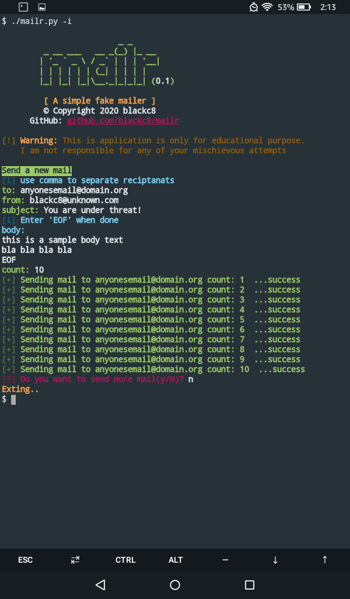

# mailr
A simple fake mailer

> The server is disabled due to Agreement Policies, you will recive error if you try sending mail .Create your own server if you want to continue.


## Warning
This is application is only for educational purpose.
I am not responsible for any of your mischievous attempts.

## Getting Started
These instructions will get you a copy of the project up and running on your local machine for development and testing purposes

### Prerequisites 
What things you need to install the software and how to install them
```
python3
```
### 1.Clone the repo
	
```
git clone https://github.com/blackc8/mailr.git
cd mailr
```

### 2.Run a test
```
./mailr.py -s "Hii, the mailr really works" -t <your email address>
```
after this just check your inbox and Hola you made it.

### 3.Sending your first fake mail
```
./mailr.py -t <reciptant's email address> -f <sender email address> -s <mail subject> -b <mail body>
```

### 4.Try the interactive mode
```
./mailr.py --interactive
````


## Usgae
```
usage: mailr.py [-h] [-i] [-t MAIL_TO] [-f MAIL_FROM] [-s SUBJECT] [-b BODY]
                [-c COUNT]

A simple fake mailer

optional arguments:
  -h, --help            show this help message and exit
  -i, --interactive     launch the interactive mode
  -t MAIL_TO, --mail_to MAIL_TO
                        email address of the reciptants
  -f MAIL_FROM, --mail_from MAIL_FROM
                        email address of the sender
  -s SUBJECT, --subject SUBJECT
                        subject of the email
  -b BODY, --body BODY  body of the email
  -c COUNT, --count COUNT
                        number of times email to be sent
```

## Making your own server
This application is based on a api which sends mails to server using the php `mail()` function.
### 1.Get a hosting
You need to get a hosting with php support and enabled `mail()` function.I have used [000webhost](https://www.000webhost.com) as its free, you can use any. 
### 2.Upload the code
Now upload the `mailr.php` to the server.
### 3.Change mailr_url in mailr.py
after you upload the `mailr.php` copy the link and paste that to your `mailr_url` variable in `mailr.py`
### 4.Done
And you are done setting up your own fake mailling server.

## Screenshots




## Contributer
*  **Initial work** - [blackc8](https://github.com/termux-lock)

##  License & copyright
© 2020 blackc8 <blackc8official@gmail.com>

Licensed under the [MIT LICENSE](LICENSE)
